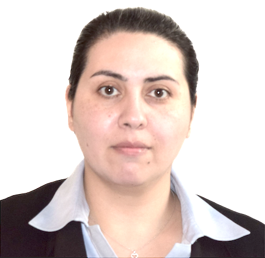

# Welcome to my website!  

<table>
  <tr>
    <td style="padding-right:15px;">
      
    </td>
    <td>
      
 Sima Ahsani, Washington and Lee University 

        
 Mathematics Department
     
        
 304 Chavis Hall 

        
 Email: sahsani@wlu.edu 

    </td>
  </tr>
</table>

## [About Me](aboutme.md) 
## Research
## Teaching
I am currently a Visiting Assistant Professor in the Department of Mathematics at Washington and Lee University. I earned my Ph.D. in Mathematics from Auburn University, with a specialization in Linear Algebra and Matrix Theory under the supervision of Professor Tin Yau Tam and Professor Ming Liao.

Before joining Washington and Lee University, I served as a Visiting Assistant Professor at Emory University in Atlanta, GA, from 2021 to 2023 and at Auburn University from 2019 to 2021.

My research is on matrix theory and its applications. Currently, I am working on matrices derived from data that are positive definite. This area offers vast potential for interdisciplinary collaboration and real-world applications. From a differential geometry perspective, positive definite matrices inhabit a non-Euclidean space and can be visualized as topological points on an open cone. This geometric interpretation enables the use of specialized distance metrics, such as the Riemannian distance, which significantly enhance classic algorithms in various domains.

I have more than ten years of experience in teaching mathematics as an independent instructor and researcher at diverse universities. I have taught a wide spectrum of courses, from developmental to upper-level and special topics. A full list of courses can be found in my teaching statement and CV.
